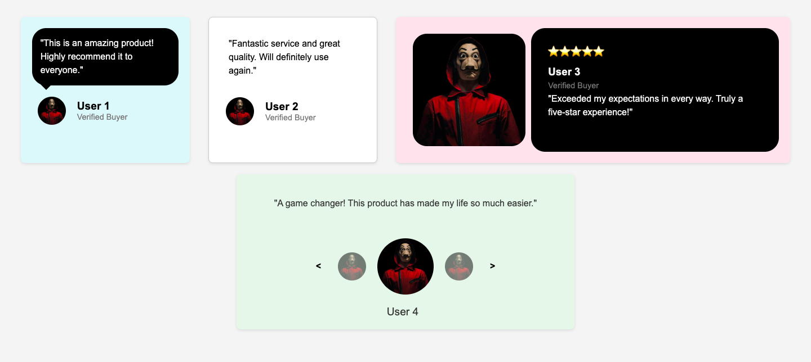

# Testimonial-Cards
In this project, I created a bunch of testimonial cards to test my knowledge about positioning and layout in CSS. This is also part of the solution to the frontend project https://roadmap.sh/projects/testimonial-cards

## How to run the project
Clone the repo and open testimonial-cards.html on your browser.

## Project Preview

